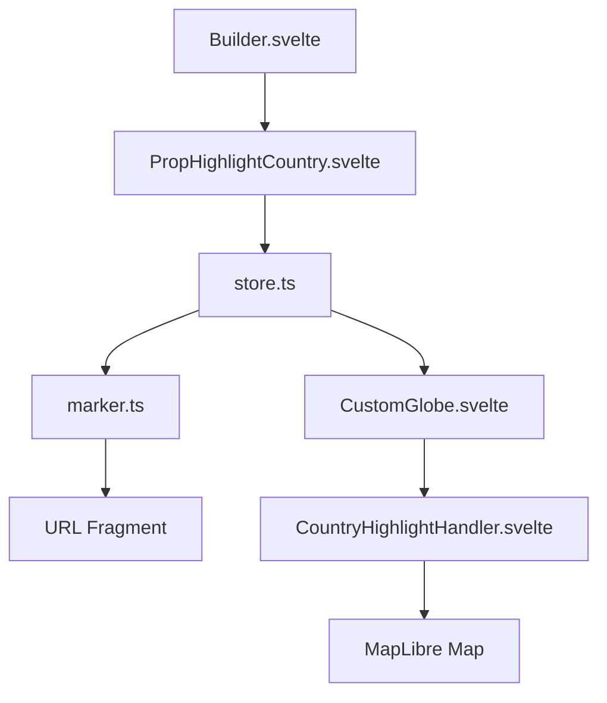

# Plan - Country Highlighting Feature

This plan outlines the steps to add a country highlighting feature to the builder and the globe.

## 1. Data Model (`src/lib/marker.ts`)

- Add `highlights?: string[]` to `DecodedObject` interface.
- Update `markerSchema` to include a `highlights` property with a custom codec.
- The codec will encode the array of country IDs (ISO codes) into a comma-separated string for the URL fragment.

## 2. Map Visualization (`src/components/CustomGlobe/features/CountryHighlightHandler.svelte`)

- Create a new feature component that listens for changes to the `highlights` prop.
- Add a GeoJSON source to the map containing country polygons.
- Add a fill layer to the map that uses this source.
- Use a filter on the fill layer to only show countries whose IDs are in the `highlights` array.
- Style the highlighted countries (e.g., a semi-transparent fill).

## 3. Builder Interaction (`src/components/Builder/PropHighlightCountry.svelte`)

- Implement map interaction logic to detect right-clicks or long-presses.
- Use `map.queryRenderedFeatures` to identify the country under the cursor (using the `place` layer from the vector tiles).
- Show a `ContextMenu` at the click location.
- The menu will display the country name and a checkbox to toggle the "Highlighted" state.
- Update the `options.highlights` in the store when the checkbox is toggled.

## 4. Integration

- Add `CountryHighlightHandler` to `CustomGlobe.svelte`.
- Add `PropHighlightCountry` to `Builder.svelte`.

## Mermaid Diagram

## Questions for the User

1. Do you have a preferred GeoJSON source for country polygons, or should I use a standard one (e.g., Natural Earth)?
2. Should the highlight color be configurable, or is a default (e.g., red or blue) sufficient?
3. For the "long click" interaction, what duration should be considered a long click? (e.g., 500ms)
